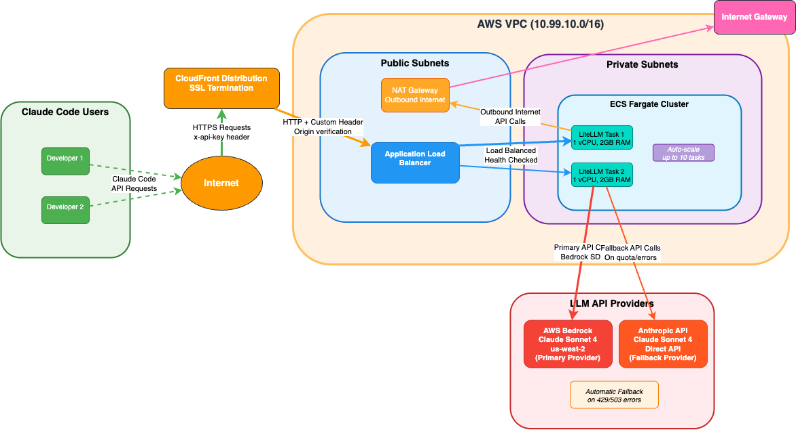

# Claude Code with LiteLLM Gateway

A minimal LiteLLM deployment with CloudFront, ALB, and ECS for Bedrock quota management with autmatic fallback to other LLM providers that you can configure Claude Code to use.

This sample is accompanied by a blog post with more context and details

## Prerequisites

- Docker and Docker Compose
- AWS CLI configured with permissions for ECS, ECR, CloudFormation, CloudFront, ALB
- SAM CLI installed (`pip install aws-sam-cli`)
- `.env` file with required API keys (see `.env.example`)

## Quick Start

### Local Deployment

```bash
# Create .env file with your API keys
cp .env.example .env
# Edit .env with your ANTHROPIC_API_KEY and LITELLM_MASTER_KEY

# Deploy locally
make deploy-local
```

After deployment, configure Claude Code with the provided environment variables:

```bash
export ANTHROPIC_BASE_URL=http://localhost:4000
export ANTHROPIC_AUTH_TOKEN=your-litellm-master-key
export ANTHROPIC_MODEL=sonnet-4
```

**Test:**

```bash
curl http://localhost:4000/v1/chat/completions \
  -H "x-api-key: your-litellm-master-key" \
  -H "Content-Type: application/json" \
  -d '{"model": "sonnet-4", "messages": [{"role": "user", "content": "Hello"}]}'
```

### AWS Deployment

```bash
# Deploy to AWS with CloudFront + ALB + ECS
make deploy-aws
```

Returns the CloudFront HTTPS URL.

**Test:**

```bash
curl https://your-cloudfront-domain.cloudfront.net/v1/chat/completions \
  -H "x-api-key: your-litellm-master-key" \
  -H "Content-Type: application/json" \
  -d '{"model": "sonnet-4", "messages": [{"role": "user", "content": "Hello"}]}'
```

**Configure Claude Code:**

```bash
export ANTHROPIC_BASE_URL=https://your-cloudfront-domain.cloudfront.net
export ANTHROPIC_AUTH_TOKEN=your-litellm-master-key
export ANTHROPIC_MODEL=sonnet-4
```

### Cleanup

```bash
# Delete all AWS resources
make delete

# Clean local containers
make clean
```

## Architecture



**Local**: Single LiteLLM container via Docker Compose

**AWS**: CloudFront → Application Load Balancer → ECS Fargate:

- **CloudFront**: TLS termination
- **Application Load Balancer**: Internet-facing
- **ECS Fargate**: Auto-scaling LiteLLM containers (2-10 tasks)
- **Security**: CloudFront managed prefix lists, custom origin headers, x-api-key authentication
- **Networking**: VPC with public/private subnets, NAT Gateway for outbound internet access

## Configuration

The LiteLLM proxy is configured with Claude 4 Sonnet and automatic fallbacks:

- `sonnet-4`: Claude 4 Sonnet via AWS Bedrock (primary)
- `sonnet-4-anthropic`: Claude 4 Sonnet via Anthropic API (fallback)

Fallback behavior: If `sonnet-4` fails, requests automatically retry with `sonnet-4-anthropic`.

## Available Commands

- `make help` - Show all available commands
- `make deploy-local` - Deploy locally with docker-compose
- `make deploy-aws` - Deploy to AWS with CloudFront + ALB + ECS
- `make delete` - Delete all AWS resources
- `make clean` - Clean up local containers

## Customization

You can override default variables (or simply update the variables in the top of the makefile):

```bash
# Custom region and names
make deploy-aws AWS_REGION=us-east-1 STACK_NAME=my-litellm ECR_REPO_NAME=my-repo

# Override environment variables
export ANTHROPIC_API_KEY=sk-ant-api03-your-key-here
export LITELLM_MASTER_KEY=sk-litellm-your-master-key
make deploy-aws
```

Environment variables can be set via `.env` file or exported directly.

> [!WARNING]  
> It's recommended to use a proper secret as the shared secret between cloudfront and the ALB. This project uses a concatenation of repository variables and the AWS account ID. To ensure it's only your cloudfront distribution that can send traffic to the ALB you should use a random secret.
